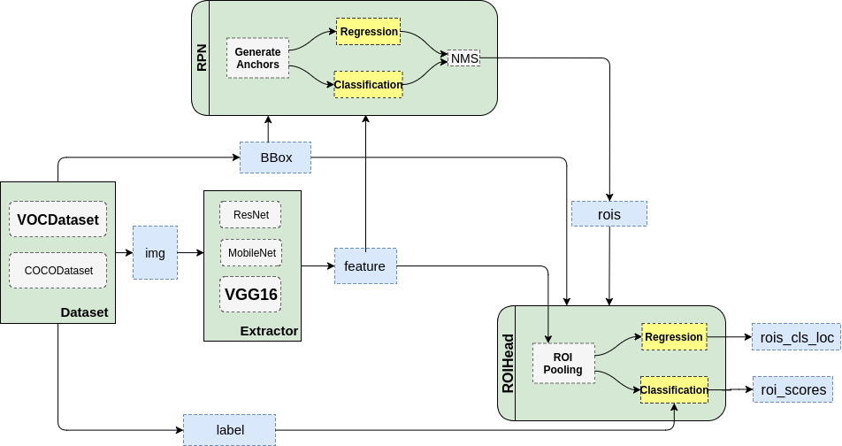
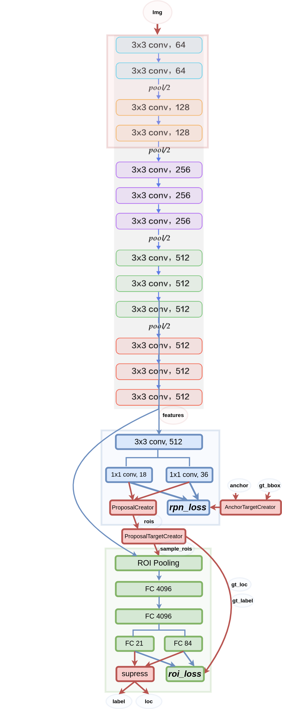
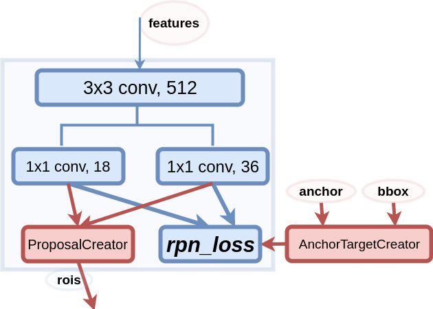
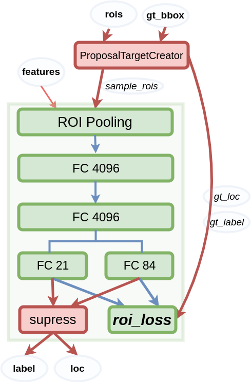

# Faster-RCNN 解析

2018 年 6 月 15 日

从源码来理解 Faster-RCNN, 此处源码使用的是第三方实现, 简洁清晰, 可读性强, 非常易于学习. 代码地址为: 

+ https://github.com/chenyuntc/simple-faster-rcnn-pytorch

另外, 作者还写了一篇关于代码的解读, 也是从代码来理解 Faster-RCNN, 看完之后就明白: 纸上得来终觉浅, 绝知此事要 coding... 专栏地址为:

+ [从编程实现角度学习Faster R-CNN(附极简实现)](https://zhuanlan.zhihu.com/p/32404424)

本文中的图片都来自上面作者的专栏.

作者的文章写得太好了, 我在这里就给出一些代码用于补充, 以便对相关的讨论有更深入的理解.

首先给出代码的整体架构以及 Faster-RCNN 的模型的示意图.


## 整体架构

simple-faster-rcnn-pytorch 代码的整体流程图如下:




## Faster-RCNN 模型

Faster-RCNN 模型如下:



上图有一些注意要点:

+ 特征的提取使用的是 VGG16, 使用 `conv5_3` 得到的特征作为 RPN 网络的输入. 一开始的四个卷积层(img 输入后的 4 个卷积层, 上面用方框框起来的)它们的参数是固定的, 训练过程中不需要更新.
+ 在 RPN 和 RoIHead 中红色方框中的内容和线条是不需要更新的, 训练过程中反向传播只经过蓝色线条.
+ 代码实现中使用的是近似联合训练(Approximate Joint Training), 即将四类 loss 相加(rpn 的分类和位置回归 loss 以及 RoI 的分类和回归 loss), 得到的损失之和作为整体的 loss 进行反向传播.


## RPN 模型

Region Proposal Network 模型如下:




## Fast RCNN 模型

在代码中被称为 RoIHead, 模型如下:




RPN 只是给出了 2000 个候选框, RoIHead 在给出的 2000 个候选框的基础上继续进行分类和**位置参数**的回归. 这 2000 个 RoIs 在 feature maps 也对应着 2000 个不同大小的区域. 首先使用 `ProposalTargetCreator` 挑选出 128 个 `sample_rois`, 然后使用 RoIPooling 将这些大小不同的区域全部 pooling 到同一个尺寸(7x7)上. 这样做的目的是, RoI Head 中的两个 FC4096 中的权重是来自 VGG16 的, 使用 RoIPooling 可以将不同尺寸大小的 RoIs pooling 成 7*7 大小, 这样就可以利用这两层的权重了(即为了共享权重). 

RoI Pooling 是一种特殊的 Pooling 操作, 给定一张图的 Feature Map(512 x H/16 x W/16), 和 128 个候选区域的坐标(128 x 4), RoI Pooling 将这些区域统一下采样到 (512 x 7 x 7), 这样就得到了 128 x 512 x 7 x 7 的向量. 可以看成一个 batch-size=128, 通道数为 512 x 7 x7 的 feature map.

要测试 RoI Pooling 的效果, 可以使用如下代码:

在上面作者的代码中的主目录下创建一个文件:

```python
from model.roi_module import RoIPooling2D
from torch.autograd import Variable
import torch

N, C, H, W, outh, outw = 1, 1, 4, 4, 2, 2
x_min, y_min, x_max, y_max = 1, 1, 3, 3
spatial_scale = 1.0


h = Variable(torch.arange(16).view(1, 1, 4, 4)).cuda()
print(h)
rois = Variable(torch.Tensor([0, x_min, y_min, x_max, y_max]).view(1, 5)).cuda()
model = RoIPooling2D(outh, outw, spatial_scale)
output = model(h, rois)
print(output)
```

上面代码的目的是, 对只有一个 batch 的图像特征 (N, C, H, W), 将其中的 rois (大小为 (1, 5), 如果有多个 rois, 那么大小为 (M, 5), 最后的输出就是 M x C x outh x outw) 指示的位置([`x_min`, `y_min`, `x_max`, `y_max`]) 处的区域 pooling 成 2x2 的大小.

**注意: 这里要特别注意 rois 的坐标是 xy 而不是 yx, 作者的源代码中表示坐标都是以 yx 的形式表示的, 但是要传入 RoI Pooling 的话, 需要将坐标进行变换, 因为 RoI Pooling 的实现 model/utils/roi_cupy.py 用的应该是 caffe 的实现, 坐标有些变化.**

也就是将 

```python
 5  6 |  7
 9 10 | 11
------------
13 14 | 15
```

pooling 成 2x2 的大小. 那么, 注意到上面的虚线区域, 将每个区域中的最大值取出来既可以了. 即:

```python
10  11
14  15
```


上面代码的结果为:

```python
Variable containing:
(0 ,0 ,.,.) =
   0   1   2   3
   4   5   6   7
   8   9  10  11
  12  13  14  15
[torch.cuda.FloatTensor of size 1x1x4x4 (GPU 0)]

Variable containing:
(0 ,0 ,.,.) =
  10  11
  14  15
[torch.cuda.FloatTensor of size 1x1x2x2 (GPU 0)]
```


## RoI Pooling

Caffe RoI Pooling 实现:

[ROI Pooling层解析](https://blog.csdn.net/lanran2/article/details/60143861)

先把roi中的坐标映射到feature map上，映射规则比较简单，就是把各个坐标除以“输入图片与feature map的大小的比值”，得到了feature map上的box坐标后，我们使用Pooling得到输出；由于输入的图片大小不一，所以这里我们使用的类似Spp Pooling，在Pooling的过程中需要计算Pooling后的结果对应到feature map上所占的范围，然后在那个范围中进行取max或者取average。

### Caffe ROI Pooling的源码解析

**1. LayerSetUp**

```cpp
template <typename Dtype>
void ROIPoolingLayer<Dtype>::LayerSetUp(const vector<Blob<Dtype>*>& bottom,
      const vector<Blob<Dtype>*>& top) {
  ROIPoolingParameter roi_pool_param = this->layer_param_.roi_pooling_param();
  //经过Pooling后的feature map的高
  pooled_height_ = roi_pool_param.pooled_h();
  //经过Pooling后的feature map的宽
  pooled_width_ = roi_pool_param.pooled_w();
  //输入图片与feature map之前的比值，这个feature map指roi pooling层的输入
  spatial_scale_ = roi_pool_param.spatial_scale();
}
```

**2. Reshape**

```cpp
template <typename Dtype>
void ROIPoolingLayer<Dtype>::Reshape(const vector<Blob<Dtype>*>& bottom,
      const vector<Blob<Dtype>*>& top) {
  //输入的feature map的channel数
  channels_ = bottom[0]->channels();
  //输入的feature map的高
  height_ = bottom[0]->height();
  //输入的feature map的宽
  width_ = bottom[0]->width();
  //设置输出的形状NCHW，N=ROI的个数，C=channels_，H=pooled_height_，W=pooled_width_
  top[0]->Reshape(bottom[1]->num(), channels_, pooled_height_,
      pooled_width_);
  //max_idx_的形状与top一致
  max_idx_.Reshape(bottom[1]->num(), channels_, pooled_height_,
      pooled_width_);
}
```

**3. Forward**

```cpp
template <typename Dtype>
void ROIPoolingLayer<Dtype>::Forward_cpu(const vector<Blob<Dtype>*>& bottom,
      const vector<Blob<Dtype>*>& top) {
  //输入有两部分组成，data和rois
  const Dtype* bottom_data = bottom[0]->cpu_data();
  const Dtype* bottom_rois = bottom[1]->cpu_data();
  // Number of ROIs
  int num_rois = bottom[1]->num();
  int batch_size = bottom[0]->num();
  int top_count = top[0]->count();
  Dtype* top_data = top[0]->mutable_cpu_data();
  caffe_set(top_count, Dtype(-FLT_MAX), top_data);
  int* argmax_data = max_idx_.mutable_cpu_data();
  caffe_set(top_count, -1, argmax_data);

  // For each ROI R = [batch_index x1 y1 x2 y2]: max pool over R
  for (int n = 0; n < num_rois; ++n) {
    int roi_batch_ind = bottom_rois[0];
    //把原图的坐标映射到feature map上面
    int roi_start_w = round(bottom_rois[1] * spatial_scale_);
    int roi_start_h = round(bottom_rois[2] * spatial_scale_);
    int roi_end_w = round(bottom_rois[3] * spatial_scale_);
    int roi_end_h = round(bottom_rois[4] * spatial_scale_);
    //计算每个roi在feature map上面的大小
    int roi_height = max(roi_end_h - roi_start_h + 1, 1);
    int roi_width = max(roi_end_w - roi_start_w + 1, 1);
    //pooling之后的feature map的一个值对应于pooling之前的feature map上的大小
    //注：由于roi的大小不一致，所以每次都需要计算一次
    const Dtype bin_size_h = static_cast<Dtype>(roi_height)
                             / static_cast<Dtype>(pooled_height_);
    const Dtype bin_size_w = static_cast<Dtype>(roi_width)
                             / static_cast<Dtype>(pooled_width_);
    //找到对应的roi的feature map，如果input data的batch size为1
    //那么roi_batch_ind=0
    const Dtype* batch_data = bottom_data + bottom[0]->offset(roi_batch_ind);
    //pooling的过程是针对每一个channel的，所以需要循环遍历
    for (int c = 0; c < channels_; ++c) {
      //计算output的每一个值，所以需要遍历一遍output，然后求出所有值
      for (int ph = 0; ph < pooled_height_; ++ph) {
        for (int pw = 0; pw < pooled_width_; ++pw) {
          // Compute pooling region for this output unit:
          //  start (included) = floor(ph * roi_height / pooled_height_)
          //  end (excluded) = ceil((ph + 1) * roi_height / pooled_height_)
          // 计算output上的一点对应于input上面区域的大小[hstart, wstart, hend, wend]
          int hstart = static_cast<int>(floor(static_cast<Dtype>(ph)
                                              * bin_size_h));
          int hend = static_cast<int>(ceil(static_cast<Dtype>(ph + 1)
                                           * bin_size_h));
          int wstart = static_cast<int>(floor(static_cast<Dtype>(pw)
                                              * bin_size_w));
          int wend = static_cast<int>(ceil(static_cast<Dtype>(pw + 1)
                                           * bin_size_w));
          //将映射后的区域平动到对应的位置[hstart, wstart, hend, wend]
          hstart = min(max(hstart + roi_start_h, 0), height_);
          hend = min(max(hend + roi_start_h, 0), height_);
          wstart = min(max(wstart + roi_start_w, 0), width_);
          wend = min(max(wend + roi_start_w, 0), width_);
          //如果映射后的矩形框不符合
          bool is_empty = (hend <= hstart) || (wend <= wstart);
          //pool_index指的是此时计算的output的值对应于output的位置
          const int pool_index = ph * pooled_width_ + pw;
          //如果矩形不符合，此处output的值设为0，此处的对应于输入区域的最大值为-1
          if (is_empty) {
            top_data[pool_index] = 0;
            argmax_data[pool_index] = -1;
          }
          //遍历output的值对应于input的区域块
          for (int h = hstart; h < hend; ++h) {
            for (int w = wstart; w < wend; ++w) {
             // 对应于input上的位置
              const int index = h * width_ + w;
              //计算区域块的最大值，保存在output对应的位置上
              //同时记录最大值的索引
              if (batch_data[index] > top_data[pool_index]) {
                top_data[pool_index] = batch_data[index];
                argmax_data[pool_index] = index;
              }
            }
          }
        }
      }
      // Increment all data pointers by one channel
      batch_data += bottom[0]->offset(0, 1);
      top_data += top[0]->offset(0, 1);
      argmax_data += max_idx_.offset(0, 1);
    }
    // Increment ROI data pointer
    bottom_rois += bottom[1]->offset(1);
  }
}
```


