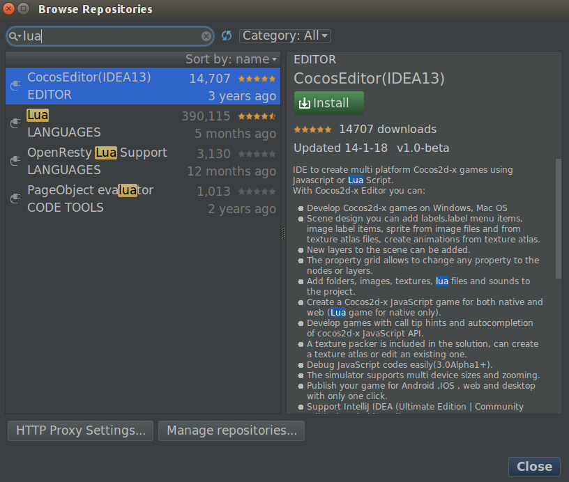
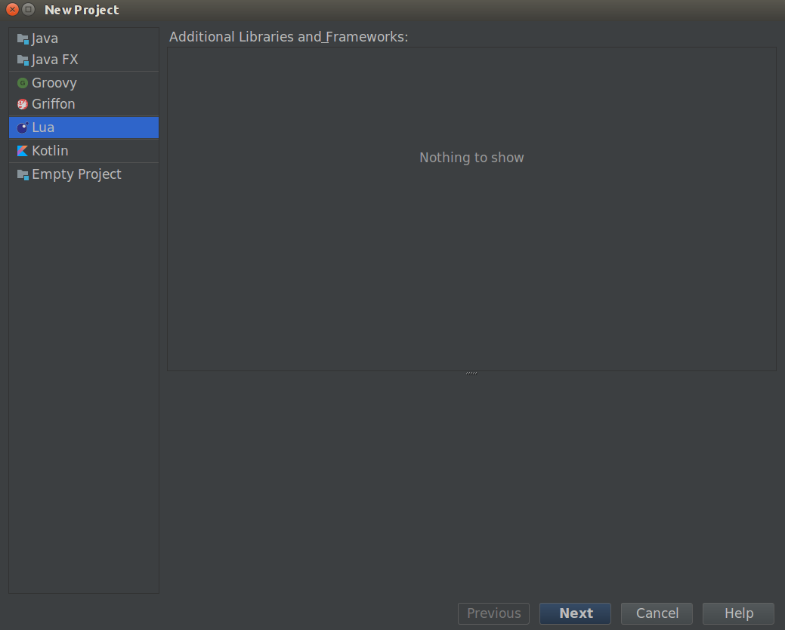
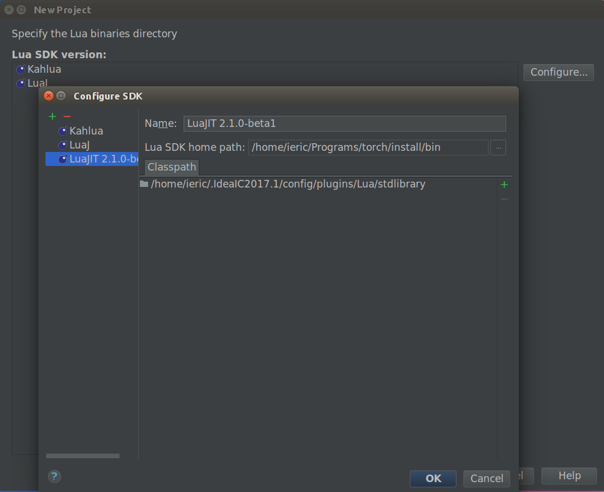
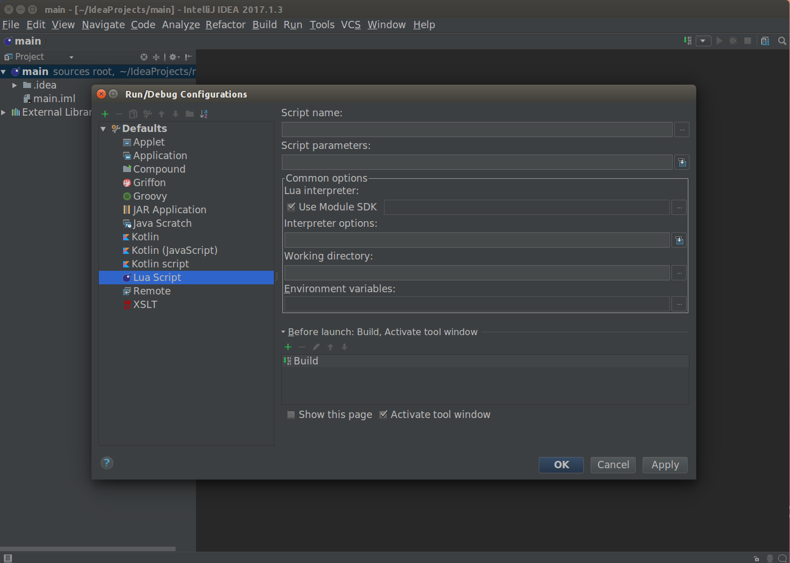
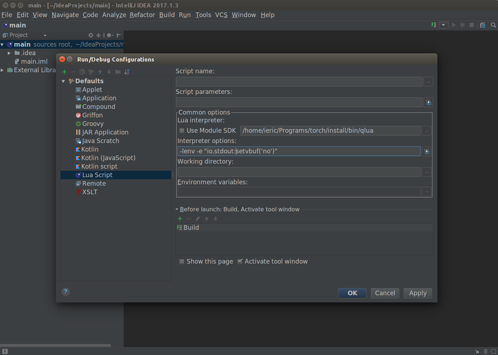
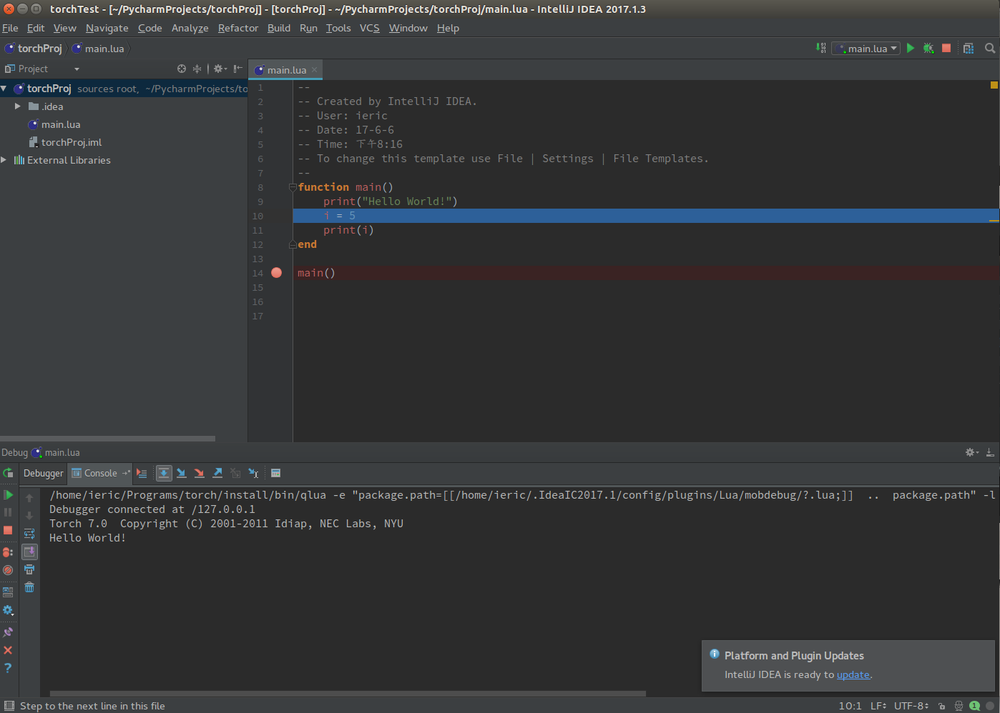
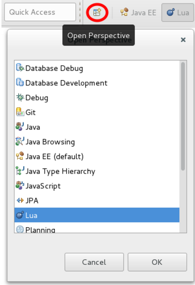
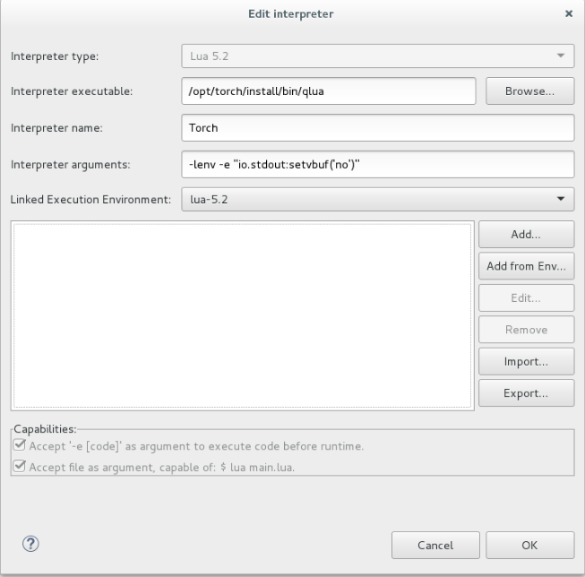
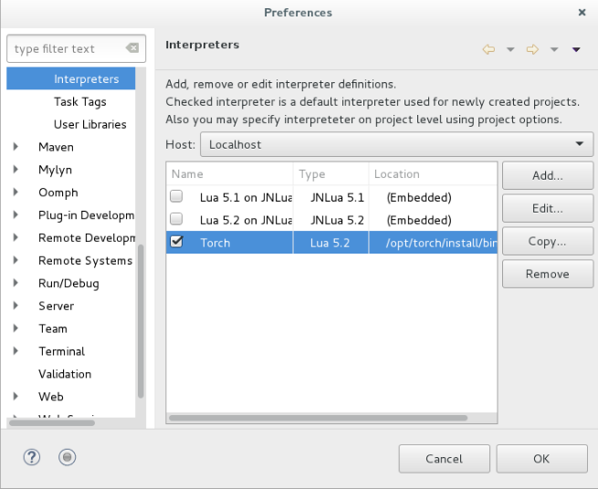
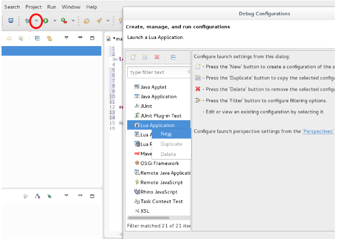

# Intellij (Eclipse) + Lua + Torch

## 安装 Intellij 

+   从 https://www.jetbrains.com/idea/#chooseYourEdition 下载 Intellij 得到安装包 `ideaIC-2017.1.3.tar.gz`, (可以使用 `aria2c --file-allocation=none -c -x 10 -s 10 <URL>` 下载), 解压后进入 `<root>/bin` 目录, 使用 `./idea.sh` 进行安装, 主要要选择将路径加入到 `/usr/local/bin` 中, 这样以后在命令行下可以使用 `idea` 打开 IDE.

+   安装 Lua 插件. 

    参考博客 [quick-cocos2d-x开发环境Lua for IntelliJ IDEA的安装](http://blog.csdn.net/kyo7552/article/details/17016409) 安装 Lua 插件. 具体如下: 

    

    打开 `Configure`, 选择 `Plugins`, 在出现的页面中点击 `Browse repositories`, 然后搜索 `Lua` 插件, 

    

    点击安装就可以了. 安装完成之后会提示重新启动软件. 

    启动后就能新建 Lua 项目了.

+   配置 Lua 项目 

    选择 `File -> New -> Project.. -> Lua` 点击 `Next`, 

    

    然后点击 `Configure`, 配置 SDK:

    

    上面的 `Name` 可以自己取, 我用了默认的 `LuaJIT 2.1.0-bata1`, 其中 `Lua SDK home path` 选择 `torch` 中的 `~/Programs/torch/install/bin`. 点击 OK 即可.

+   现在虽然可以用 torch 跑代码了, 但是要 Debug 的话, 还需要进行配置. 

+   在菜单 `Run` 下选择 `Edit Configurations..`, 进入到如下页面:

    

    然后按照下图进行配置, 首先取消勾选 `Use Module SDK`, 然后选择 torch 中的 qlua.

    

    `Lua interpreter` 选择 `/home/ieric/Programs/torch/install/bin/qlua`;

    `Interpreter options` 填上 `-lenv -e "io.stdout:setvbuff('no')"`;

    最后点 OK 即可. 然后写个 Hello World 看看能不能正确调试:

    

    这次能配置好, 都依赖于下面几条信息:

    +   [quick-cocos2d-x开发环境Lua for IntelliJ IDEA的安装](http://blog.csdn.net/kyo7552/article/details/17016409)
    +   [Running torch in IntelliJ](https://groups.google.com/forum/#!msg/torch7/NMuxZld6hBM/tfCvDxjYOwAJ) (Google Group)
    +   [Add/Find Lua SDK when installed with Torch](https://bitbucket.org/sylvanaar2/lua-for-idea/issues/183/add-find-lua-sdk-when-installed-with-torch)
    +   [Configuring Eclipse with Torch](http://www.lighting-torch.com/2015/07/27/configuring-eclipse-with-torch/)

## 使用 Eclipse

+   在 `Help -> Install New Software` 中使用如下的地址:

    ```bash
    http://download.eclipse.org/ldt/releases/stable
    ```

    或者: 

    ```bash
    http://download.eclipse.org/ldt/releases/milestones/
    ```

    参看官网: https://eclipse.org/ldt/

+   选择 Lua 的开发工具, 当然是全选了. 

+   然后就是稍微等待下载安装. 安装好之后可以使用 Lua Perspective. 参看 [Configuring Eclipse with Torch](http://www.lighting-torch.com/2015/07/27/configuring-eclipse-with-torch/)

    

    这说明可以创建 Lua 项目了.

+   根据 [Configuring Eclipse with Torch](http://www.lighting-torch.com/2015/07/27/configuring-eclipse-with-torch/) 所介绍的, Eclipse 默认使用 Lua 5.1, 若要选择最新的 5.2, 需要

    +   Go `Windows -> Perference`
    +   Go to `Lua -> Execution Environment` and select `Lua-5.2`
    +   Go to `Lua -> Grammars`  and select `Lua-5.2`
    +   Go to `Lua -> Interpreters` and select `Lua-5.2`

    This will enable to have a Lua with a 5.2 environment. A few change will be made while using Torch.

+   然后创建一个 Lua 工程

+   现在在 Eclipse 中使用 torch. 博客中说需要知道的一点是:

    >   A lot of Lua interpreters are already embedded in LDT, but torch is not. So we are going to manually configure the interpretor. One should know that Torch does not follow the standard LuaDocs format. Therefore, the auto-completion will not work. I think it can be tricked,  but that’s another topic.

+   首先安装额外的依赖项:

    ```bash
    $> luarocks install luasocket
    $> sudo apt-get install libcanberra-gtk-module
    ```

+   然后配置 torch 解释器:

    +   Go to `Windows -> Project -> Preference`
    +   Go to `Lua Interpreters -> Add..`
        +   Interpreter type : Lua 5.2 *
        +   Interpreter executable : `/home/ieric/Programs/torch/install/bin/qlua`
            -   by default, qlua is installed on ~/torch/install/bin/qlua  (
            -   You may type “$> *which th*” in a terminal to get the interpreter installation path
        +   Interpreter arguments : `-lenv -e "io.stdout:setvbuf('no')"`
        +   Linked Execution Environment : Lua-5.2
    +   Click Ok
    +   Pick Torch as your default interpreter

    

    

+   We now have to configure the “run configurations” to execute our program in both debug/release mode. First the debug and most important, debug mode.

    1.  Go to the upper-left
    2.  Select the arrow next to the weird beetle
    3.  Look for Lua Application –> Right Click
    4.  Select new

    

+   A “New_configuration” project should open, select it.

    1.  Choose a name for script to execute Lua
    2.  Check that your default Interpreter is Torch
    3.  Break on first Line –> that will force to use the debug perspective on execution

+   You can start running/debugging your program!